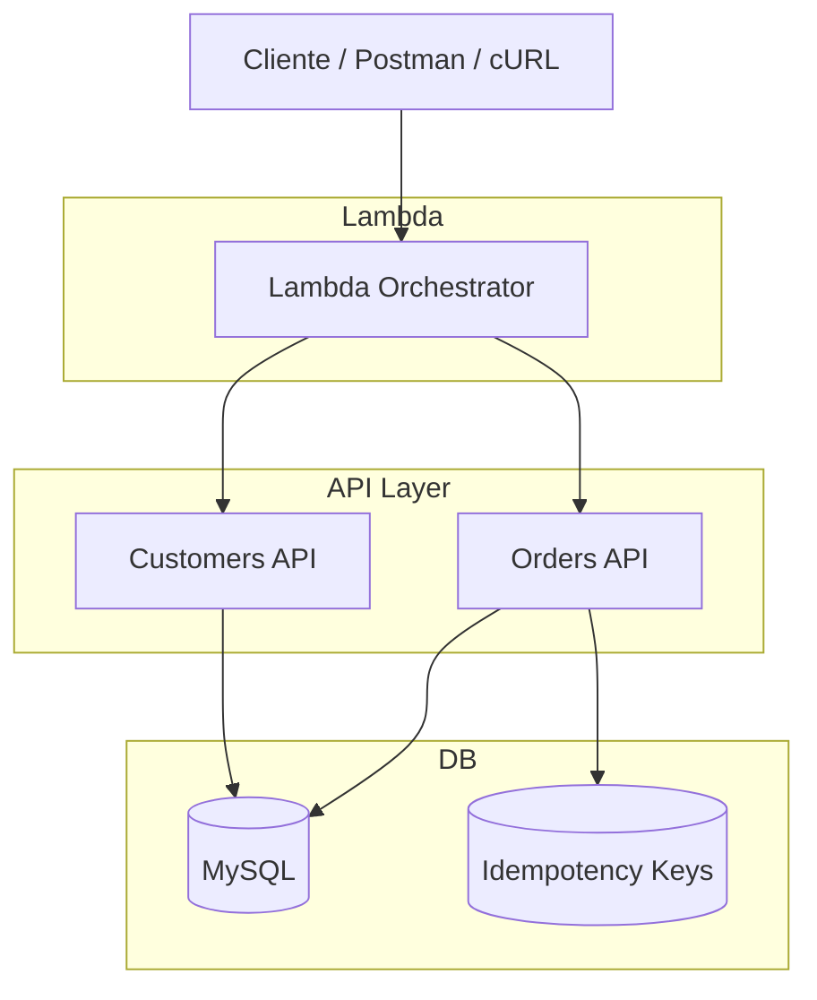

# Prueba tecnica Integration Engineer para Jelou

Sistema mínimo para gestión de **clientes, productos y pedidos** en un entorno B2B.  
Incluye dos APIs (`Customers API`, `Orders API`), un **Lambda Orchestrator** y una base de datos **MySQL** en Docker.

---

## 📂 Estructura del monorepo


├── customers-api/ # API de clientes <br>
├── orders-api/ # API de productos y pedidos<br>
├── lambda-orchestrator/ # Lambda que orquesta creación y confirmación de pedidos<br>
├── db/<br>
│ ├── schema.sql # Definición de tablas <br>
│ └── seed.sql # Datos iniciales <br>
├── docker-compose.yml # DB + APIs <br>
├── docker-compose.swagger.yml # Swagger UI <br>
└── README.md # Documentación del proyecto

## 🏗️ Arquitectura



---

## ⚙️ Requisitos

- Docker y Docker Compose
- Node.js v22+
- AWS CLI (para despliegue en AWS)
- Serverless Framework (`npm i -g serverless`)

---

## 🚀 Levantar el entorno local

### 1. Copiar variables de entorno

En cada servicio (`customers-api`, `orders-api`, `lambda-orchestrator`) hay un archivo `.env.example`.
Cópialo a `.env`:

```bash
cp customers-api/.env.example customers-api/.env
cp orders-api/.env.example orders-api/.env
cp lambda-orchestrator/.env.example lambda-orchestrator/.env
````

### 2. Levantar DB + APIs

```bash
docker compose up -d --build
```

### 3. Endpoints de salud

Customers API → http://localhost:3001/health

Orders API → http://localhost:3002/health

### 📘 Documentación OpenAPI (Swagger)

Levantar Swagger UI

```bash
docker compose -f docker-compose.swagger.yml up -d
```

Abrir en navegador 👉 http://localhost:8080

Podrás ver specs para:

Customers API

Orders API

Orchestrator

### 🔑 Variables de entorno principales

```bash
Customers API (.env)
PORT=3001
DB_HOST=mysql
DB_USER=appuser
DB_PASSWORD=apppass
DB_NAME=order_management
JWT_SECRET=supersecret
SERVICE_TOKEN=servicetoken123

Orders API (.env)
PORT=3002
DB_HOST=mysql
DB_USER=appuser
DB_PASSWORD=apppass
DB_NAME=order_management
JWT_SECRET=supersecret
CUSTOMERS_API_BASE=http://customers-api:3001
SERVICE_TOKEN=servicetoken123

Lambda Orchestrator (.env)
CUSTOMERS_API_BASE=http://localhost:3001
ORDERS_API_BASE=http://localhost:3002

```

### 🧪 Ejemplos cURL

Crear cliente

curl -X POST http://localhost:3001/customers \
 -H "Content-Type: application/json" \
 -d '{"name":"ACME","email":"ops@acme.com","phone":"+1-555-0101"}'

Buscar productos

curl "http://localhost:3002/products?search=laptop&limit=5"

Crear orden

curl -X POST http://localhost:3002/orders \
 -H "Content-Type: application/json" \
 -d '{"customer_id":1,"items":[{"product_id":2,"qty":3}]}'

Confirmar orden (idempotente)

curl -X POST http://localhost:3002/orders/1/confirm \
 -H "X-Idempotency-Key: abc-123"

Cancelar orden

curl -X POST http://localhost:3002/orders/1/cancel

🛠️ Lambda Orchestrator
Ejecutar en local

```bash
cd lambda-orchestrator
npm install
npm run dev
```

Endpoint disponible en:
http://localhost:3000/dev/orchestrator/create-and-confirm-order

Ejemplo request

curl -X POST http://localhost:3000/dev/orchestrator/create-and-confirm-order \
 -H "Content-Type: application/json" \
 -d '{
"customer_id": 1,
"items": [{ "product_id": 2, "qty": 3 }],
"idempotency_key": "abc-123",
"correlation_id": "req-789"
}'

### ☁️ Despliegue en AWS

1. Configurar credenciales

   ```bash
   aws configure
   ```

2. Desplegar Lambda Orchestrator

   ```bash
   cd lambda-orchestrator
     serverless deploy
   ```

Configura las variables de entorno (CUSTOMERS_API_BASE, ORDERS_API_BASE, SERVICE_TOKEN) con las URLs públicas de tus APIs.

3. Invocar Lambda en AWS

Después del deploy, verás una URL tipo:

https://<api-id>.execute-api.us-east-1.amazonaws.com/dev/orchestrator/create-and-confirm-order

Prueba con cURL o Postman como en el ejemplo anterior.
